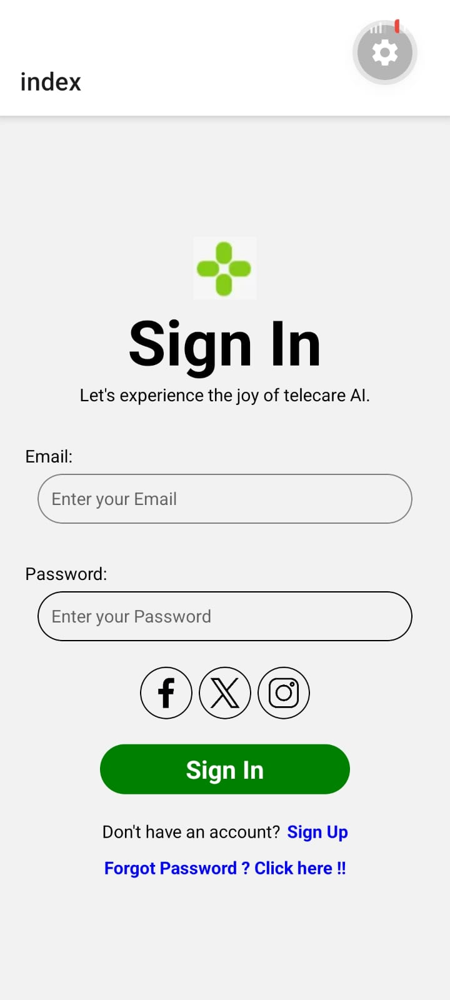

# Telecare AI - Sign In Page

A beautiful, responsive Sign-In screen built with **React Native** and **Expo**. This project demonstrates a clean user interface layout using Flexbox, complete with text inputs and social media authentication icons.

## Features

- **Centered Layout**: Uses Flexbox to keep elements perfectly centered and aligned on any screen size.
- **Form Inputs**: Includes beautifully styled `TextInput` components for Email and Password.
- **Social Logins**: Displays rounded social media icons (Facebook, Twitter, Instagram) inside circular wrapper views.
- **Action Buttons**: Features a prominent "Sign In" button and interactive text links for "Sign Up" and "Forgot Password".

## Tech Stack

- **Framework**: [React Native](https://reactnative.dev/)
- **Build Tool**: [Expo](https://expo.dev/)
- **Language**: TypeScript (`.tsx`)

## Project Structure

The main UI code is located in:
`src/app/index.tsx`

## Getting Started

1. **Install Dependencies** (if you haven't already):
   ```bash
   npm install
   ```

2. **Start the Development Server**:
   ```bash
   npx expo start
   ```

3. **View the App**:
   - Scan the QR code with the Expo Go app on your physical device.

## Preview



